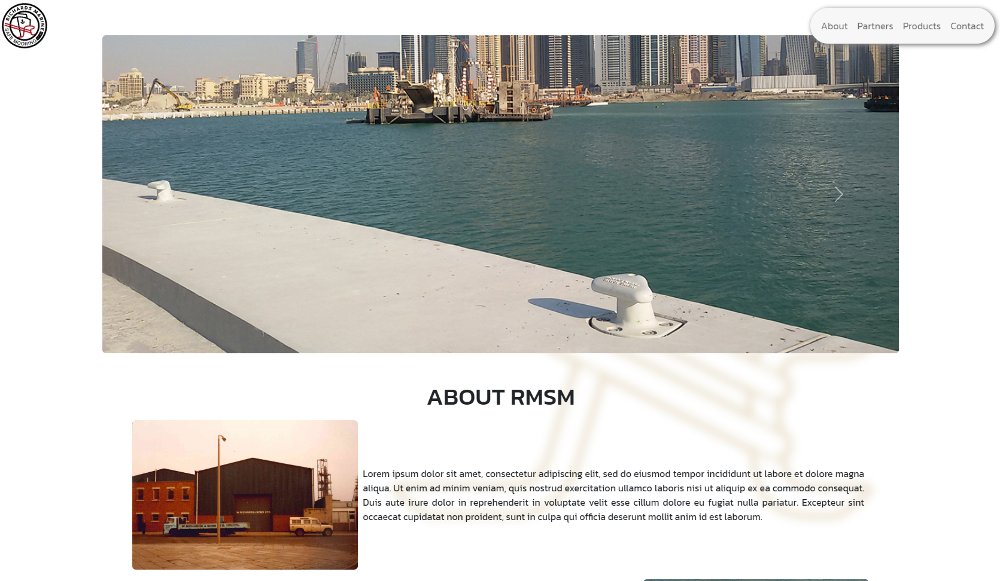

# Richards Marine - Corporate website built using React

## Overview

This is a real world website for an international marine furniture company. The site is built wiht react and uses EmailJS for the contact form functionality. 

It is still in progress and is yet to be populated with the client's information and officially deployed. It is currently deployed on Heroku for client collaboration.

### Links

 [Heroku Deployment](https://dry-river-92667.herokuapp.com/)

 [Github Repo](https://github.com/sashdc/richard-marine)

 ## Credits

Cherian, Saharsh

[Creator Github](https://github.com/sashdc)

